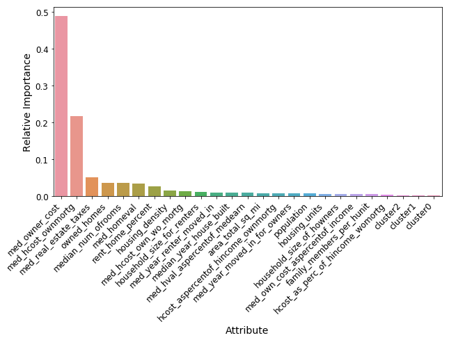
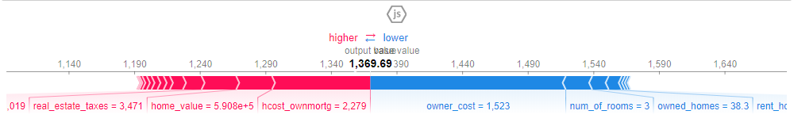

## California_Housing_Project
[Web Application](https://rental-rate-calculator.herokuapp.com/) 
[Written Report](https://github.com/clazaro97chosen/California_Housing_Project/blob/master/reports/California_Housing_Report.pdf) 
[Story About Applicable Results](#A-story-about-applicable-results-from-the-project) 
[Repository Organization](#Repository-Organization)

## Overview (tl;dr)

The passing of Tenant Protection Act of 2019 in California ushers in an era of tighter rent controls that California landlords must understand and adjust to. This projects main goal is to provide current landlords with insights towards determining the rental price of their property based on attributes of their property and city real estate market. The objective was to build a model of median rental rate using a subset of variables collected for each city in California from Towncharts.com (a website that provides free housing market data mostly taking from the most recent 2018 American Community Survey). Currently estimates that take into account landlords property attributes and attributes of their cities real estate market are outsourced and often come at a cost. A minimum performance measure of a Root Mean Squared Error of 196 dollars two days of work for an individual working minimum wage was desired. This project applies an Ensemble Learning model consisting of two estimators an Elastic Net and Random Forest Regressor which achieves a RMSE on the test set of 197.95 dollars just shy of our business goal. We find that the monthly cost of housing for property owners including mortgage payment, taxes, insurance,and utilities is the number one predictor of median rental rates. While median housing cost for homeowners with a mortgage(including the cost of the mortgage or other debt) is the number-two predictor of median rental rates and both share a linear relationship with median rental rate. We note that some interesting outlier cities Bradbury, Vernon, Industry, Indian Wells. For future research the model may be improved by obtaining further predictors of median rental rate from other sources. Specifically, Towncharts.com has Education, Economy, and Demographic Data for California cities that may be further gathered and could prove to be valuable in reducing the RMSE performance measure of the Ensemble model. Lastly, a good idea would be to seek domain expertise in regards to what valuable categorical variables should be accounted for when predicting median rental price for a property in a certain city. 

#### Keywords
California Housing Market, Median Rental Rate, Ensemble Learning, Towncharts.com, python, scikit-learn

## A story about applicable results from the project.
Bob Ross is a 40 year old college professor. He has 1 kid in college and is widowed. Unfortunately for Bob he has had  a series of unexpected financial expenses that have rendered him to temporarily fall behind on his mortgage payments on his 3 bedroom house in [San Luis Obispo](https://www.google.com/search?q=san+luis+obispo&oq=sa&aqs=chrome.0.69i59j69i57j69i59l2j69i60l3j69i65.906j0j7&sourceid=chrome&ie=UTF-8), CA. While talking to his friend Tim about his troubles Tim tells him that he can flip the script by renting his home for a period of time. He explains that this may be a good option when two factors are present: Your home would rent for at or more than your mortgage payment and you were able to find an affordable place to stay. San Luis Obispo is a College Town and Bob believes he can rent his home during the school year while he rents a small apartment to help cover the costs before moving back in. Tim says that to determine the rental price of your property, consult directly with a real estate agent or property management company to take a look at comparable rentals in your area. But, before doing so Tim invites Bob over to do some research of their own.Tim is savvy with python and has done some research that he presents to Bob.

He explains that across California the top 3 predictors of median rental rates are monthly cost of housing for property owners including mortgage payment, taxes, insurance,and utilities, median housing cost for homeowners with a mortgage(including the cost of the mortgage or other debt), and the median real estate taxes paid by owners of homes in the area.

Additionally, Tim also shows Bob the figure below and suggest that after taking into account the variables displayed above  his real estate taxes paid, home evaluation i.e. how much the property is worth if it was for sale, and housing cost(including the cost of the mortgage or other debt) contribute to increasing the rental price of his property. On the other hand it suggest his owner cost(monthly cost of housing including mortgage payment, taxes, insurance,and utilities), the number of rooms, and the fact the percent of all occupied housing units that are owned housing units is 38(%) in San Luis Obispo  contribute to decreasing rental price of his property.

Tim tells Bob that he can come up with a prediction 
of the rental price of his property within a margin of error of 196 dollars that takes into account several pieces of information about his property and the local real estate market in San Luis Obispo.  Bob thanks Tim for his help he tells him that this will give him a better understanding of whether the quote he receives from the consultant is an accurate estimate. Bob then goes to Linda a real estate agent and rather than be in a state of unknowing he knows that the estimate Linda provides to him aligns with the prediction Tim had provided him. As a result Bob has piece of mind that he has received a fair estimate of the rental price of his property.

## Repository Organization
------------

    ├── LICENSE
    ├── README.md          <- The top-level README for developers using this project.
    ├── datasets
    │   ├── external       <- Data from third party sources.
    │   ├── processed      <- The final, canonical data sets for modeling.
    │   └── raw            <- The original, immutable data dump.
    │
    ├── models             <- Trained and serialized models, model predictions
    │
    ├── notebooks          <- Jupyter notebooks.
    │
    ├── references         <- Data Information (sources, data dictionaries, manuals)
    │
    ├── reports            <- Generated analysis as HTML
    │
    ├── requirements.txt   <- The requirements file for reproducing the analysis environment, e.g.
    │                         generated with `pip freeze > requirements.txt`
    │
    ├── src                <- Source code for use in this project.
    │   ├── __init__.py    <- Makes src a Python module
    │   │
    │   │
    │   ├── modeling        <- Scripts to train models, prepare data or perform         |   |                      feature selection, and to train and predict on final     |   |                      test data         
    │   │   ├── model_tryout.py
    │   │   └── prep_or_featureselection.py
    |   |   └── train_and_predict.py
    │   │
    │   └── visualizing  <- Scripts to create exploratory and results oriented visualizations
    │       └── heatmap.py credit  is to Drazen Zaric(https://github.com/drazenz)
    
    

--------
